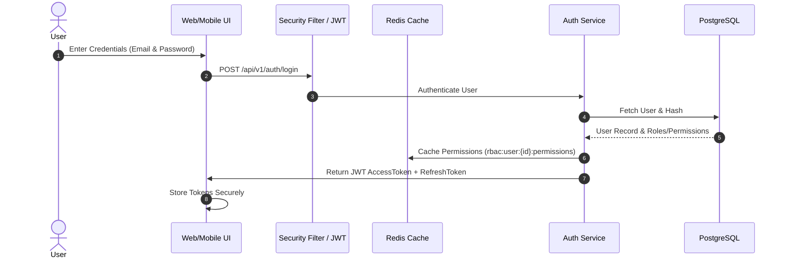
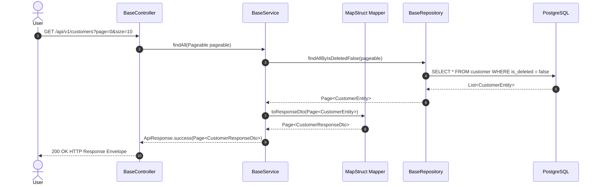

# Overall Architecture Specification (`ARCHITECTURE.md`)

> **DASP Digital MVP Boilerplate Framework**  
> Clean Architecture | SOLID Principles | Interface-Driven Development | Reusable Enterprise Layering

---

## 📐 1. Architectural Philosophy

The framework strictly adheres to **Clean Architecture** and **SOLID Principles**:

1. **Single Responsibility Principle (SRP)**: Each class performs one distinct responsibility. Controllers map requests, Services enforce rules, Repositories query database tables, Mappers convert data structures.
2. **Open/Closed Principle (OCP)**: Extensible strategy interfaces (`NotificationProvider`, `StorageProvider`) allow adding vendors (e.g., Twilio SMS, AWS S3) without modifying existing code.
3. **Liskov Substitution Principle (LSP)**: Derived base classes (`BaseServiceImpl`) can seamlessly substitute core service contracts without breaking consumers.
4. **Interface Segregation Principle (ISP)**: Granular interfaces are exposed for distinct operations rather than bloated monolithic interfaces.
5. **Dependency Inversion Principle (DIP)**: Controllers depend on Service interfaces; Services depend on Repository interfaces. No concrete coupling.

---

## 🔄 2. End-to-End Request Flow & Sequence Diagrams

### Authentication & Token Flow



### Request Execution Sequence Diagram



---

## 🛡️ 3. Layer Dependency Rules

```text
               ┌───────────────────────┐
               │    Controller Layer   │
               └───────────┬───────────┘
                           │  (Uses DTOs & Mappers)
                           ▼
               ┌───────────────────────┐
               │   Service Interface   │
               └───────────┬───────────┘
                           │
                           ▼
               ┌───────────────────────┐
               │ Service Implementation│
               └───────────┬───────────┘
                           │  (Uses Entities)
                           ▼
               ┌───────────────────────┐
               │    Repository Layer   │
               └───────────┬───────────┘
                           │
                           ▼
               ┌───────────────────────┐
               │   PostgreSQL Database │
               └───────────────────────┘
```

> **Strict Rule**: Direct access from Controllers to Repositories or Database entities is strictly forbidden and monitored via static code analysis.
